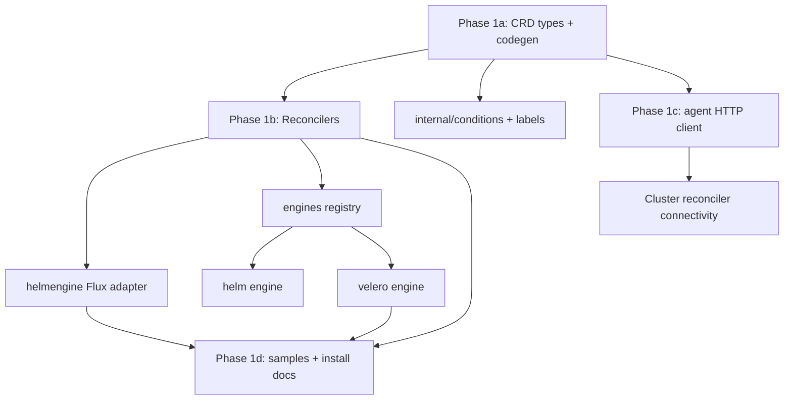

# Implementation guide

**Status:** Alpha — living handoff document for Phase 1 foundation work.
**Last Updated:** 2026-05-29
**Audience:** Engineers continuing vworkspace-operator development.

This document breaks Phase 1 into continuable sub-phases, defines acceptance criteria, and explains how to resume work on any day. It complements [ROADMAP.md](../../ROADMAP.md) (milestones) and [project-layout.md](project-layout.md) (directory contract).

## Source of truth

| Topic | Document |
|-------|----------|
| Product design | [ODOO_K8S_APPLICATION_MANAGER_OPERATOR.md](https://github.com/vworkspace-io/vworkspace/blob/main/docs/technical/ODOO_K8S_APPLICATION_MANAGER_OPERATOR.md) |
| ApplicationInstance API | [docs/api/application-instance.md](../api/application-instance.md) |
| Operation API | [docs/api/operation.md](../api/operation.md) |
| Conditions | [docs/api/conditions.md](../api/conditions.md) |
| Pull-mode protocol | [docs/connectivity/job-protocol.md](../connectivity/job-protocol.md) |
| ADRs | [docs/adr/README.md](../adr/README.md) |

## Phase breakdown

### Phase 1a — Scaffold and CRDs (done in this session)

**Goal:** Runnable Kubebuilder project with typed CRDs and generated manifests.

| Deliverable | Path |
|-------------|------|
| Go module | `go.mod`, `go.sum` |
| ApplicationInstance types | `api/apps/v1alpha1/` |
| Operation + Cluster types | `api/ops/v1alpha1/` |
| Generated CRDs | `config/crd/bases/*.yaml` |
| Kustomize install layout | `config/default/`, `config/manager/`, `config/rbac/` |
| Makefile / Dockerfile / CI | `Makefile`, `Dockerfile`, `.github/workflows/ci.yml` |
| Condition helpers | `internal/conditions/` |
| Label constants | `internal/labels/` |

**Acceptance criteria**

- `make manifests generate` succeeds and produces committed CRD YAML.
- `make test` passes (unit + envtest controller suite).
- `./hack/verify-generated.sh` exits 0 on a clean tree.
- CRD OpenAPI validates required fields on `ApplicationInstance` and `Operation`.

**Tests**

- `internal/controller/validation_test.go` — spec validation.
- envtest suite bootstraps CRDs from `config/crd/bases`.

### Phase 1b — Reconcilers and engines (partially done)

**Goal:** Idempotent reconciliation with interface-driven engines.

| Deliverable | Path | Status |
|-------------|------|--------|
| ApplicationInstance reconciler | `internal/controller/applicationinstance_controller.go` | MVP |
| Operation reconciler | `internal/controller/operation_controller.go` | MVP |
| Cluster reconciler | `internal/controller/cluster_controller.go` | Stub |
| Flux Helm engine | `internal/helmengine/flux.go` | MVP |
| Helm upgrade engine | `internal/engines/helm.go` | MVP |
| Velero engine | `internal/engines/velero.go` | MVP |
| Engine registry | `internal/engines/registry.go` | Done |

**Acceptance criteria**

- Applying a valid `ApplicationInstance` creates `HelmRelease` + chart source (Flux).
- Invalid spec sets `Blocked=True` without panicking.
- `Operation` with `engine: velero` creates `velero.io/Backup`.
- Conflicting operations on the same target set `Blocked=True` (reason `ConflictingOperation`).
- Deleting `ApplicationInstance` removes finalizer after HelmRelease cleanup attempt.

**Tests to extend**

- HelmRelease materialization assertions in envtest (Flux CRDs not yet in envtest — use fake client tests in `internal/helmengine/`).
- Operation concurrency matrix table tests.
- Velero restore parameter validation.

### Phase 1c — Pull-mode agent loop (stub)

**Goal:** HTTP client matching job protocol; job application deferred.

| Deliverable | Path | Status |
|-------------|------|--------|
| Agent interface + HTTP client | `internal/agent/client.go` | MVP |
| Poll loop stub | `internal/agent/poller.go` | Stub |
| Credential loading from Secret | `internal/agent/credentials.go` | Not started |
| Server-side apply of job payloads | `internal/agent/applier.go` | Not started |

**Acceptance criteria**

- Unit tests parse request/response shapes (`internal/agent/client_test.go`).
- `Cluster` reconciler reports `Connected=True` when heartbeat succeeds (mock server test).
- Poller goroutine registered from `cmd/main.go` when env configured.

**Tests**

- httptest coverage for `FetchJobs`, `AckJob`, `ReportResult`, `PostEvents`.

### Phase 1d — Install path and samples (next)

**Goal:** Documented end-to-end path on kind/k3s.

| Deliverable | Path |
|-------------|------|
| Sample CRs | `config/samples/` |
| Quickstart validation | `docs/install/quickstart.md` |
| RBAC review | `config/rbac/role.yaml` vs `docs/security/rbac.md` |

**Acceptance criteria**

- `make deploy IMG=...` installs operator + CRDs on kind.
- Sample `ApplicationInstance` reconciles when Flux CRDs are present.
- Velero CRD present for backup `Operation`.

## Dependency order



Hard ordering:

1. API types before `make manifests`.
2. Generated CRDs before envtest controller tests.
3. Helm engine before ApplicationInstance reconciler integration tests against real apiserver.
4. Agent client before Pull-mode job applier.
5. Admission webhooks (Phase 2) after validation helpers in `internal/controller/`.

## How to resume work

### Branch strategy

- `main` — docs + released tags only after Phase 1 exit criteria.
- `feat/phase-1-foundation` — active Phase 1 work (this session).
- Future: `feat/phase-1b-agent-applier`, `feat/phase-1c-install` as focused PRs.

### Daily startup checklist

```bash
cd vworkspace-operator
git fetch origin
git checkout feat/phase-1-foundation   # or your topic branch
make setup-envtest                     # first time only
make test
make run                               # optional, against kind
```

### Definition of done (per sub-phase)

A sub-phase is **done** when:

1. All acceptance criteria above are met.
2. `make test` and `./hack/verify-generated.sh` pass.
3. Relevant docs updated in the same PR (not deferred).
4. CHANGELOG `[Unreleased]` entry added.
5. ROADMAP checkboxes updated.

## Rollback and versioning

### Git tags

- Pre-release tags: `v0.0.x` aligned with [ROADMAP.md](../../ROADMAP.md).
- Tag only from `main` after CI green; container image tag matches git tag.

### Feature flags

Use command-line flags and environment variables (no compile-time toggles):

| Flag / env | Purpose |
|------------|---------|
| `--odoo-base-url` / `ODOO_BASE_URL` | Enable Pull-mode client |
| `--agent-token` / `VWORKSPACE_AGENT_TOKEN` | Bearer token |
| `--cluster-id` / `VWORKSPACE_CLUSTER_ID` | Cluster identity |

Disable Pull-mode by omitting Odoo URL; reconcilers continue for in-cluster CRs.

### CRD versioning

- All APIs at `v1alpha1`; stored version only.
- Breaking changes require a new API version and conversion webhook (Phase 2 scaffold in `internal/webhook/`).
- Roll back operator Deployment independently of CRDs; CRDs are backward-compatible within `v1alpha1` unless documented.

## Testing requirements summary

| Area | Package | Type |
|------|---------|------|
| ApplicationInstance validation | `internal/controller` | unit |
| HelmRelease materialization | `internal/helmengine` | fake client |
| Condition mapping | `internal/helmengine` | unit |
| Engine registry | `internal/engines` | unit |
| Velero CR creation | `internal/engines` | fake client |
| Agent HTTP protocol | `internal/agent` | httptest |
| Reconciler integration | `internal/controller` | envtest |

Run everything: `make test`.

## Related ADRs

- [ADR 0002 — Helm-first via Flux HelmRelease](../adr/0002-helm-first-via-flux-helmrelease.md)
- [ADR 0003 — Pull mode as default connectivity](../adr/0003-pull-mode-as-default-connectivity.md)
- [ADR 0004 — Two CRDs](../adr/0004-two-crds-applicationinstance-and-operation.md)
- [ADR 0005 — One operator per cluster](../adr/0005-one-operator-per-cluster.md)

## Phase 1b next session (suggested)

1. Wire agent poller in `cmd/main.go` with credential Secret loader.
2. Implement server-side apply for `apply` jobs (`internal/agent/applier.go`).
3. Add envtest or integration test with Flux CRDs loaded.
4. Resolve `values.secretRef` / `values.configMapRef` in helm engine.
5. Push-mode is already CR-native; document that Pull-mode job applier is the remaining transport piece.
